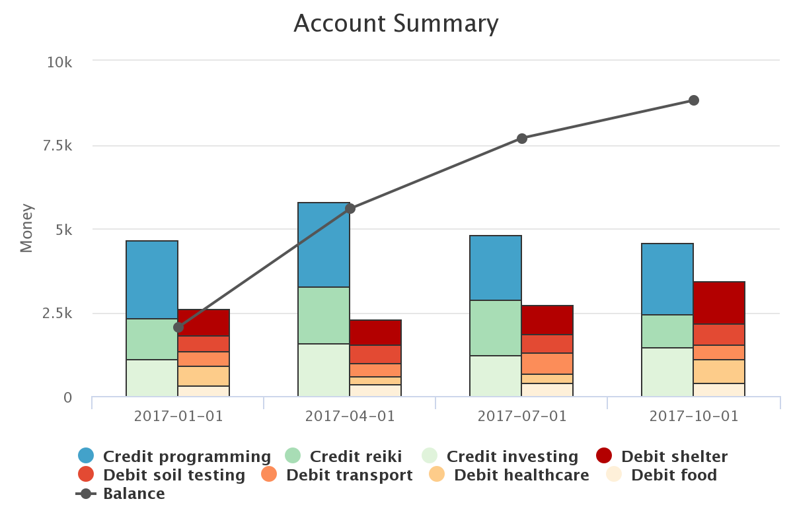

Mustaching
**********

.. image:: http://mybinder.org/badge.svg
    :target: http://mybinder.org:/repo/araichev/mustaching

.. image:: https://travis-ci.org/araichev/mustaching.svg?branch=master
    :target: https://travis-ci.org/araichev/mustaching

A tiny Python 3.6+ library inspired by Mr. Money Mustache to summarize and plot personal finance data given in a CSV file of transactions.
Uses Pandas and Python-Highcharts to do most of the work.

Smacks of `plain text accounting <http://plaintextaccounting.org/>`_ but is limited to single-entry transactions and focuses only on income and expenses.
For full-featured double-entry bookkeeping in Python, use a different library, such as `beancount <https://bitbucket.org/blais/beancount/overview>`_.

Installation
=============
``pip install mustaching``

Usage
=========
Play with the IPython notebook at ``ipynb/examples.ipynb``.
You can even do so online by clicking the Binder badge above.
Using Binder you can also upload your own transaction data into the notebook, but consider first `Binder's warning about private data <http://docs.mybinder.org/faq>`_.

Your CSV of transactions should contain at least the following columns

- ``'date'``: string; something consistent and recognizable by Pandas, e.g 2016-11-26
- ``'amount'``: float; amount of transaction; positive or negative, indicating an income or expense, respectively
- ``'description'`` (optional): string; description of transaction, e.g. 'dandelion and burdock tea'
- ``'category'`` (optional): string; categorization of description, e.g. 'healthcare'
- ``'comment'`` (optional): string; comment on transaction, e.g. 'a gram of prevention is worth 16 grams of cure'

The business logic can be found in ``mustaching/main.py``

Documentation
==============
At `https://raichev.net/mustaching_docs <https://raichev.net/mustaching_docs>`_.

Notes
========
- Development status: Alpha
- This project uses semantic versioning

Authors
========
- Alex Raichev, 2016-11

Changes
=======

3.1.1, 2019-04-03
------------------
- Switched to Poetry.
- Published docs using publish-sphinx-docs.
- Published on PyPi.
- Dropped unused categories in ``summarize()``.